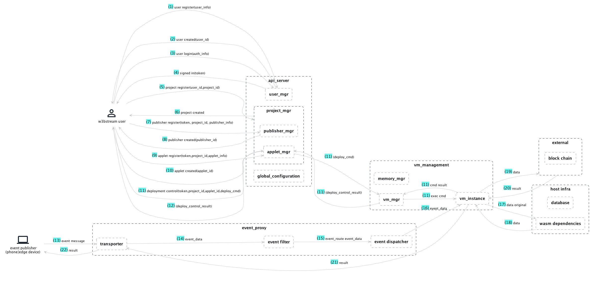

# W3bstream

## Overview

W3bStream is a general framework for connecting data generated by devices and machines in the physical world to the blockchain world. In a nutshell, W3bStream uses the IoTeX blockchain to orchestrate a decentralized network of gateways (i.e., W3bStream nodes) that streams encrypted data from IoT devices and machines and generates proofs of real-world facts to different blockchains. A overview graphic of W3bstream is 


## Documentation

Plese visit [https://docs.w3bstream.com/](https://docs.w3bstream.com/).

Interested in contributing to the doc? Please edit on [Github](https://github.com/machinefi/w3bstream-docs-gitbook) 

## Arch



## Run W3bstream node with prebuilt docker images

Make a path for w3bstream node. In the path, run the following command

```bash
curl https://raw.githubusercontent.com/machinefi/w3bstream/main/docker-compose.yaml > docker-compose.yaml
```

Edit the config in the `yaml` file if needed. Then run

```bash
docker-compose -p w3bstream -f ./docker-compose.yaml up -d
```

Your node should be up and running. 

Please note: the docker images are hosted at [GitHub Docker Registry](https://github.com/machinefi/w3bstream/pkgs/container/w3bstream)


## Access W3bstream Studio

W3bstream Studio is a web tool that allows W3bstream node operators to administrate their node, deploy and run applets, and explore data.

Visit http://localhost:3000 to get started. The default admin password is `iotex.W3B.admin`. Learn more from [documentation](https://docs.w3bstream.com/get-started/w3bstream-studio).

Interested in W3bstream Studio source code? Check it out here [https://github.com/machinefi/w3bstream-studio](https://github.com/machinefi/w3bstream-studio).

## Build docker image from code

If you are interested in diving into the code and run the node using a locally built docker, here is the steps of building the docker image from code.

### init submodules

```bash
make init_submodules
```

### Update studio to latest if needed

```bash
make update_studio
```

### Build docker images

```bash
make build_docker_images
```

### Run server in docker containers

```bash
 make run_docker
 ```

 ### Stop server running in docker containers
 ```bash
 make stop_docker
 ```
 ### Delete docker resources
 ```bash
 make drop_docker
 ```

## Build binary from code

This section is for building the W3bstream binanry files from code. 

### Dependencies:

- OS : macOS(11.0+) / Linux (tested on Ubuntu 16+)
- Go: golang (1.18+)
- Docker: to start a postgres
- Tinygo: to build wasm code
- make: run makefile
- GCC: 11.3.0
- protobuf: 3.12+
- Httpie: (optional) a simple curl command (used to interact with W3bstream node via cli)

### Init protocols and database

```sh
make run_depends # start postgres and mqtt
make migrate     # create or update schema
```

### Start a server

```sh
make run_server
```

### Interact with W3bstream using CLI

Please refer to [HOWTO.md](./HOWTO.md) for more details.
